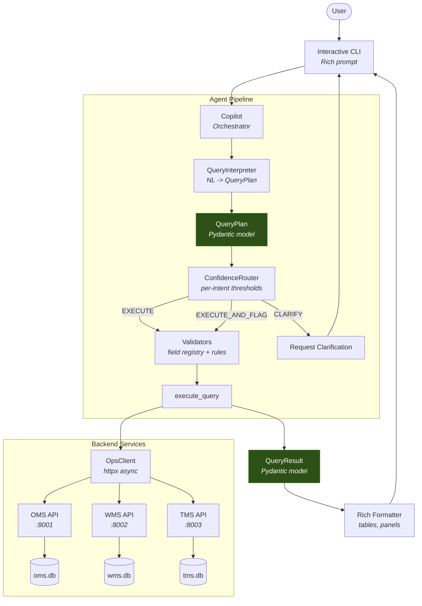

# Supply Chain Ops Assistant

> A supply-chain operations copilot — ask about orders, inventory, and shipments across OMS, WMS, and TMS in natural language. A Claude **tool-use** interpreter (Haiku 4.5) turns free-form queries into a validated, typed query plan, with a deterministic rule-based interpreter as a typed fallback. Interpreter quality is measured against a labeled eval set — the LLM lifts intent accuracy from 52% to 97% (see [Evaluation](#evaluation)).

---

## The Problem

Supply chain operations teams live inside a fragmented toolchain. On any given morning, an ops lead might check order status in the OMS, flip to the WMS to verify inventory levels at three fulfillment centers, then open the TMS to track a carrier's SLA compliance -- all before their 9 AM standup. Each system has its own query interface, its own filter syntax, and its own export format. Cross-referencing data means pasting order IDs into spreadsheets, manually correlating shipment statuses with exception logs, and building ad-hoc pivot tables that are stale by the time anyone reads them.

After spending time with fulfillment ops teams, the pattern became clear: the information exists, but accessing it requires too much context-switching and too much manual glue. A CX rep looking up a customer's order has to know which system holds the answer. An ops lead investigating a spike in exceptions has to query two systems and mentally join the results. The cognitive overhead is not in the data -- it is in the navigation.

This project is an attempt to collapse that friction into a single conversational interface. Instead of learning three query languages, an operator types "show me all orders with delayed shipments" and the system figures out which backends to hit, how to join the results, and how to present them. The goal is not to replace the underlying systems but to provide a unified read layer that speaks the operator's language.

---

## Architecture

The system follows a **single-agent-with-tools** pattern. One copilot agent receives natural language input, interprets it into a structured query plan, routes it through confidence-based decision logic, validates it against business rules, executes it against one or more backend APIs, and formats the result for display.

```
User
  |
  v
CLI (Rich interactive prompt)
  |
  v
Copilot
  |
  +-- interpret  -->  QueryInterpreter  -->  QueryPlan (Pydantic)
  |
  +-- route      -->  ConfidenceRouter  -->  EXECUTE | EXECUTE_AND_FLAG | CLARIFY
  |
  +-- validate   -->  Validators        -->  field registry + business rules
  |
  +-- execute    -->  OpsClient (httpx)  -->  OMS API (FastAPI + SQLite)
  |                                      -->  WMS API (FastAPI + SQLite)
  |                                      -->  TMS API (FastAPI + SQLite)
  |
  v
QueryResult (Pydantic)  -->  Rich formatted tables  -->  Terminal output
```

**Why single-agent, not multi-agent?** For structured operations queries against known systems, a single agent with well-defined tools is simpler, more reliable, and easier to audit than a multi-agent handoff chain. Every query follows the same pipeline. There are no ambiguous routing decisions between agents, no message-passing protocols to debug, and no emergent behaviors to monitor. The confidence router handles the one real branching decision -- whether to execute, flag for review, or ask for clarification -- and it does so with explicit, per-intent thresholds rather than LLM-generated routing logic.

---

## Architecture Diagram



---

## Capabilities by Persona

### Ops Lead

| Query | What it does |
|-------|-------------|
| `Show me all critical exceptions` | Lists open exceptions from the OMS filtered by severity |
| `What orders are at risk?` | Finds orders approaching their promised delivery date that haven't shipped |
| `Show me pending orders` | Lists all orders in pending status |
| `Show orders and shipments` | Cross-system join of OMS orders with TMS shipment data |

### Customer Experience Rep

| Query | What it does |
|-------|-------------|
| `Show me all orders` | Lists orders with status, customer tier, value, and center |
| `Show shipments` | Lists all shipments with carrier, status, SLA status, and tracking numbers |
| `Show me low stock items` | Surfaces inventory items below reorder point for proactive CX alerts |

### Finance / Logistics

| Query | What it does |
|-------|-------------|
| `Show SLA breaches` | Lists shipments that have breached their SLA commitments |
| `Show me all inventory` | Full inventory view across fulfillment centers |
| `Show exceptions` | Exception log with type, severity, status, and assignment |

---

## Quick Start

### Prerequisites

- Python 3.11+
- [uv](https://docs.astral.sh/uv/) (recommended) or pip
- Docker and Docker Compose (for containerized setup)

### Option 1: Docker (recommended)

```bash
git clone https://github.com/nick-railsback/supply-chain-ops-assistant.git
cd supply-chain-ops-assistant
cp .env.example .env

# Start all services and seed the databases
docker compose up --build
```

The `docker compose` stack starts the three API services (OMS on `:8001`, WMS on `:8002`, TMS on `:8003`), seeds the databases with realistic test data, and launches the interactive copilot CLI.

### Option 2: Local Development

```bash
git clone https://github.com/nick-railsback/supply-chain-ops-assistant.git
cd supply-chain-ops-assistant
cp .env.example .env

# Install dependencies
uv sync

# Seed the databases with test data
make seed

# Start the three API services (background processes)
make serve

# Launch the interactive CLI
python -c "from cli.interactive import main; main()"
```

### Verify It Works

Once the CLI starts, you should see a health check confirming all three services are operational:

```
  Supply Chain Ops Assistant
Checking system health...
  OMS - operational
  WMS - operational
  TMS - operational

All systems operational. Type your question or /help for examples.

ops-copilot >
```

Try a query:

```
ops-copilot > Show me all pending orders
```

---

## How It Works

Here is what happens when you ask `what orders are pending`:

**1. Interpretation.** The `QueryInterpreter` calls Claude with a single forced tool (`emit_query_plan`), so the interpretation comes back as schema-valid arguments — there is no free-text JSON to parse. The model classifies the intent (`STATUS_CHECK`), target system (`OMS`), primary entity (`order`), and a `status = pending` filter, and emits the confidence *signals* behind its read. If the LLM is unavailable, a deterministic rule-based interpreter produces the same shape; either way the path is recorded on `interpretation_source`. The result is a `QueryPlan` Pydantic model:

```python
QueryPlan(
    intent=UserIntent.STATUS_CHECK,
    target_systems=[TargetSystem.OMS],
    primary_entity="order",
    filters=[DataFilter(field="status", operator="eq", value="pending")],
    confidence=0.99,  # derived from emitted signals, not a constant
    reasoning="User is asking for orders in pending status.",
    interpretation_source="llm",
    confidence_signals=ConfidenceSignals(
        single_clear_intent=True, entity_unambiguous=True,
        all_filter_fields_known=True, time_reference_resolved=True,
    ),
)
```

> **LLM interpreter, rule fallback.** When an `ANTHROPIC_API_KEY` is set, Claude tool-use is the default interpreter; the rule layer (keyword/regex, a *subset* of phrasings) is a typed fallback for when the key is absent or a call fails. Which path produced a plan is recorded on `interpretation_source`, so a fallback is never silent. The lift is measured, not asserted: on the 33-case gold set the LLM raises intent accuracy from 52% → 97% and clarification precision from 18% → 75% (see [Evaluation](#evaluation)).

**2. Confidence Routing.** The `ConfidenceRouter` looks up the threshold for `status_check` intent: auto-execute at `0.75`, flag at `0.45`. Since `0.75 >= 0.75`, the decision is `EXECUTE` -- proceed without confirmation.

**3. Validation.** The `Validators` module checks each filter against the field registry. The field `("oms", "order", "status")` is registered as type `enum`, and the operator `eq` is valid for enums. No errors.

**4. Execution.** The `execute_query` function dispatches to `OpsClient.list_orders(status="pending")`, which sends an async HTTP GET to the OMS API at `localhost:8001/orders?status=pending`. The API queries the SQLite database via SQLAlchemy and returns a paginated response.

**5. Formatting.** The `QueryResult` is passed to the Rich formatter, which detects the data type as `orders` and renders a color-coded table with columns for Order ID, Status, Customer Tier, Total Value, Channel, and Center. Statuses are color-coded: `pending` in yellow, `delivered` in green, `exception` in red.

---

## Design Decisions

### Single Agent vs Multi-Agent

A multi-agent architecture (separate agents for OMS, WMS, TMS) would add coordination overhead without proportional benefit. The query space is well-defined: three systems, known entities, predictable filter patterns. A single agent with a dispatcher can handle cross-system queries via `asyncio.gather` without the complexity of inter-agent messaging. The confidence router provides the only meaningful branching logic, and it operates on explicit numeric thresholds rather than LLM-generated decisions.

### Mock APIs via HTTP vs Direct Database Access

Each backend (OMS, WMS, TMS) runs as a real FastAPI service with its own SQLite database, rather than the copilot querying databases directly. This enforces service boundaries that mirror production architecture: the copilot only knows HTTP endpoints, not schema details. It also makes the system testable with `pytest-httpx` and deployable with Docker Compose where each service is an independent container with health checks.

### Rich CLI vs Web UI

A terminal-based CLI using the Rich library provides formatted tables, color-coded statuses, and interactive prompts without the overhead of a frontend build system. Ops teams already spend significant time in terminals. Rich panels with status-aware coloring (green for delivered, yellow for in-transit, red for exceptions) convey information density that matches the operational context.

### Pydantic Everywhere

Every boundary in the system is typed with Pydantic models: `QueryPlan` between interpretation and routing, `QueryResult` between execution and formatting, `ActionProposal` for mutation requests, `PaginatedResponse[T]` for API responses. This provides validation at every handoff point and makes the data contracts self-documenting. The `from_attributes=True` config on base models enables direct SQLAlchemy ORM to Pydantic conversion.

### Per-Intent Confidence Thresholds

Not all intents carry equal risk. A `status_check` auto-executes at confidence `0.75` because a wrong read query wastes a second of compute. An `action_request` requires confidence `0.90` because a wrong mutation could escalate the wrong exceptions. The threshold table:

| Intent | Auto-Execute | Flag for Review |
|--------|-------------|----------------|
| `status_check` | 0.75 | 0.45 |
| `cross_system_query` | 0.80 | 0.50 |
| `analysis` | 0.80 | 0.50 |
| `action_request` | 0.90 | 0.60 |
| `report` | 0.75 | 0.45 |

> **On calibration:** the rule fallback emits a fixed heuristic confidence (`0.75` for any matched pattern), so routing under it is effectively deterministic per intent. The Claude interpreter is better: confidence is *derived deterministically from named signals* the model emits — `single_clear_intent`, `entity_unambiguous`, `all_filter_fields_known`, `time_reference_resolved` — so it is explainable rather than a magic number. The [Evaluation](#evaluation) harness then reports confidence against empirical accuracy, so the claim is measured. (That table surfaced a real finding — see Evaluation — that the larger model is better calibrated at the top of its range but less accurate overall.)

---

## Safety

Because the assistant can *mutate* live systems — update order status, assign or resolve exceptions, escalate orders, flag shipments, bulk-update — the action path is deliberately fail-safe. It never defaults to "yes" on a write.

**Confirmation is a hard gate.** Every `ActionProposal` carries `requires_confirmation` (default `True`). `execute_action` refuses to touch a backend when a proposal requires confirmation and hasn't been explicitly confirmed: it raises `ActionNotConfirmedError` *before* any mutation rather than proceeding. The library helper `confirm_action` auto-approves only proposals that don't require confirmation; anything riskier must be approved by a human, and the CLI's interactive prompt (`prompt_confirmation`) defaults to **No**.

**Risk is assessed, not assumed.** `propose_action` grades each proposal: one target is `LOW`, 2–10 is `MEDIUM`, more than 10 is `HIGH`, and any irreversible status (`cancelled`, `returned`, `refunded`) forces `HIGH` regardless of count. Anything above `LOW` — or any proposal touching more than five targets — requires confirmation.

**Bulk writes are capped.** A `BULK_UPDATE` affecting more than `settings.bulk_update_cap` (default 50) targets fails validation outright, so a misinterpreted "update all …" can't fan out unbounded.

**Only valid state transitions are allowed.** Order status updates are checked against an explicit transition map (`validators.ORDER_STATUS_TRANSITIONS`): e.g. `pending → {confirmed, cancelled}` and `shipped → in_transit`, while terminal states (`cancelled`, `returned`) permit no onward transition. An update naming an illegal transition is rejected with the allowed set, and one that can't identify the order's *current* status is rejected too — the validator needs both ends of the transition.

**Reads and writes gate on confidence differently.** A wrong read wastes a second; a wrong write escalates the wrong exception. So `action_request` carries the highest auto-execute threshold (`0.90`) — see [Per-Intent Confidence Thresholds](#per-intent-confidence-thresholds).

---

## Test Scenarios

The test suite includes 10 scenario files in `tests/scenarios/`, each defining a natural language query with expected behavior:

| # | Scenario | Query | Intent | Systems |
|---|----------|-------|--------|---------|
| 01 | Order status check | "What is the status of order ORD-2024-000123?" | `status_check` | OMS |
| 02 | Shipment tracking | "Where is shipment SHP-20240115-00042 right now?" | `status_check` | TMS |
| 03 | Low stock inventory | "Show me all items below reorder point in the WMS" | `analysis` | WMS |
| 04 | Cross-system join | "Show me all orders that have delayed shipments" | `cross_system_query` | OMS, TMS |
| 05 | Exception summary report | "Generate a report of all open exceptions grouped by severity" | `report` | OMS |
| 06 | Resolve exception | "Resolve exception EXC-0042 as fixed" | `action_request` | OMS |
| 07 | Ambiguous query | "What about the thing from yesterday?" | `clarification_needed` | -- |
| 08 | WMS-TMS cross-system | "Show inventory items currently being shipped to fulfillment centers" | `cross_system_query` | WMS, TMS |
| 09 | Order analysis by channel | "Analyze order volume and exception rates by sales channel" | `analysis` | OMS |
| 10 | Bulk escalation | "Escalate all critical severity exceptions open for more than 24 hours" | `action_request` | OMS |

---

## Evaluation

Interpreter quality is **measured, not asserted.** The harness in [`evals/`](evals/) scores natural-language → `QueryPlan` accuracy against gold labels in `evals/dataset.jsonl` (33 cases and growing) across three arms: the deterministic **rule-based** fallback, and the **Claude tool-use** interpreter on **Haiku 4.5** (default) and **Sonnet 4.6**.

```bash
make eval                                                   # rule arm (offline, no API key)
make eval EVAL_ARGS="--arm both"                            # rule vs LLM (Haiku) lift table
LLM_MODEL=claude-sonnet-4-6 make eval EVAL_ARGS="--arm llm" # Sonnet comparison
```

**Measured lift (33 cases, `temperature=0`):**

| Metric | Rule | Haiku 4.5 | Sonnet 4.6 |
|--------|------|-----------|-----------|
| Intent accuracy | 52% | **97%** | 76% |
| Target-system match (exact) | 52% | **85%** | 73% |
| Filter extraction | 25% | **50%** | 42% |
| Clarification precision | 18% | **75%** | 30% |
| Clarification recall | 100% | 100% | 100% |
| Cost / 33-case run | — | ~$0.07 | ~$0.25 |

The rule baseline is deliberately unflattering: it drops filters it has no pattern for, misclassifies `report` / `analysis` / `action_request` phrasings, and **over-clarifies** (100% recall, 18% precision — it asks for clarification on most queries it can't pattern-match). Its confidence collapses to two constants (`0.2` / `0.75`), so its reliability table has two rows. The Claude interpreter closes that gap: forced tool-use returns schema-valid plans by construction, and confidence derived from emitted signals gives a reliability table that spans real bands.

**A finding worth stating plainly: the cheaper, faster model won.** Haiku 4.5 outscores Sonnet 4.6 on every accuracy metric here, at ~⅓ the cost. Sonnet's failure mode is *over-clarification* — it declines ~7 queries it could have answered (30% clarification precision), a cautious-but-less-useful behavior — whereas Haiku commits. Sonnet is better calibrated at the very top of its confidence range (0.9–1.0 → 100% accurate), but that conservatism costs it overall accuracy. For a structured-classification task against known systems, the smaller model is the right production default — which is why it is the default in `config/settings.py`. *(Caveat: N=33, one run per arm at `temperature=0`; the gold set is being expanded before treating the gap as definitive. The residual Haiku misses are mostly an "exceptions live in OMS" domain fact not yet stated in the prompt.)*

---

## Project Structure

```
supply-chain-ops-assistant/
|
|-- agent/                        # Copilot agent layer
|   |-- copilot.py                # Main orchestrator: interpret -> route -> validate -> execute
|   |-- llm.py                    # Shared Claude tool-use client (forced tool_choice, caching)
|   |-- query_interpreter.py      # NL to QueryPlan (Claude tool-use, rule-based fallback)
|   |-- confidence.py             # Per-intent confidence routing with three outcomes
|   |-- action_handler.py         # Action proposal generation for mutations
|   |-- report_generator.py       # Structured report generation
|   +-- validators.py             # Field registry, operator validation, status transitions
|
|-- models/                       # Pydantic models (shared data contracts)
|   |-- shared.py                 # Base classes, enums (TargetSystem, UserIntent, Severity)
|   |-- query.py                  # QueryPlan, DataFilter, QueryResult
|   |-- action.py                 # ActionProposal, ActionType
|   |-- report.py                 # ReportOutput, ReportSection
|   |-- oms.py                    # Order, LineItem, OrderException, ExceptionSummary
|   |-- wms.py                    # InventoryItem, FulfillmentCenter, StockMovement
|   +-- tms.py                    # Shipment, ShipmentWithTracking, CarrierStats, SLASummary
|
|-- services/                     # Backend API services
|   |-- common.py                 # FastAPI app factory with trace middleware and health checks
|   |-- middleware.py             # X-Trace-ID / X-Span-ID propagation middleware
|   |-- exceptions.py            # Typed service exceptions (NotFound, Unavailable, Validation)
|   |-- client.py                # OpsClient: unified async HTTP client for all three APIs
|   |-- oms_api.py               # OMS FastAPI app with SQLAlchemy ORM (orders, exceptions)
|   |-- wms_api.py               # WMS FastAPI app (inventory, centers, movements)
|   +-- tms_api.py               # TMS FastAPI app (shipments, tracking, carrier stats)
|
|-- cli/                          # Interactive terminal interface
|   +-- interactive.py           # Rich CLI with prompt loop, formatters, action confirmation
|
|-- config/                       # Configuration and prompts
|   |-- settings.py              # Pydantic Settings with per-intent confidence thresholds
|   |-- prompts.py               # LLM prompt templates (interpreter, action, report)
|   +-- logging.py               # Structured logging with trace/span context vars
|
|-- seed/                         # Test data generation
|   |-- seed_db.py               # CLI entry point: creates and populates all three databases
|   |-- generator.py             # Faker-based data generators for orders, inventory, shipments
|   |-- constants.py             # Seed data constants (SKUs, carriers, centers, channels)
|   +-- context.py               # Cross-system context for referential integrity
|
|-- tests/                        # Test suite
|   |-- conftest.py              # Shared fixtures (mock clients, test data)
|   |-- test_queries.py          # Scenario-driven query integration tests
|   |-- test_unit.py             # Unit tests for interpreter, router, validators
|   +-- scenarios/               # 10 JSON scenario files defining expected behavior
|
|-- scripts/
|   |-- run_demo.py              # Demo script for quick showcase
|   +-- seed.py                  # Alternative seed entry point
|
|-- docker-compose.yml            # Multi-service Docker stack with health checks
|-- Dockerfile                    # Multi-stage build (builder + runtime)
|-- Makefile                      # Dev commands: lint, format, typecheck, test, seed, serve
|-- pyproject.toml                # Project metadata and tool config (ruff, mypy, pytest)
+-- .env.example                  # Environment variable template
```

---

## Tech Stack

| Layer | Technology | Rationale |
|-------|-----------|-----------|
| Language | Python 3.11+ | Async-first, strong typing with `|` union syntax, ecosystem depth |
| Agent Orchestration | Custom Copilot class | Explicit pipeline stages, no framework lock-in, full auditability |
| LLM Integration | Anthropic Claude (tool-use) | Claude is the default interpreter — forced `tool_choice` for schema-valid plans, prompt caching, `temperature=0` — on Haiku 4.5; the rule-based interpreter is a typed fallback. See [Evaluation](#evaluation). |
| Data Validation | Pydantic v2 | Runtime type enforcement at every boundary, JSON schema generation |
| Configuration | pydantic-settings | Typed env vars with `.env` file support and validation |
| API Framework | FastAPI | Async-native, automatic OpenAPI docs, Pydantic integration |
| HTTP Client | httpx | Async HTTP with connection pooling, timeout control, retry support |
| Database | SQLite + aiosqlite | Zero-config, file-based, async-compatible via SQLAlchemy |
| ORM | SQLAlchemy 2.0 (async) | Mapped columns, async sessions, `from_attributes` Pydantic compat |
| CLI Framework | Rich | Formatted tables, color-coded statuses, panels, spinners, prompts |
| Test Data | Faker | Realistic names, dates, addresses for seed data generation |
| Testing | pytest + pytest-asyncio | Async test support, fixture composition, scenario parameterization |
| HTTP Mocking | pytest-httpx | Intercept and mock httpx calls for isolated client testing |
| Linting | Ruff | Fast Python linter and formatter (replaces flake8 + isort + black) |
| Type Checking | mypy | Static type verification across all modules |
| Package Manager | uv | Fast dependency resolution and virtual environment management |
| Containerization | Docker + Compose | Multi-service orchestration with health checks and volume mounts |
| Observability | structlog + trace middleware | Structured JSON logs with X-Trace-ID propagation across services |

---

## Development

```bash
# Run linter
make lint

# Auto-format
make format

# Type checking
make typecheck

# Run tests
make test

# Reseed databases
make seed
```

---

## License

This project is a portfolio demonstration piece. See the repository for license details.
